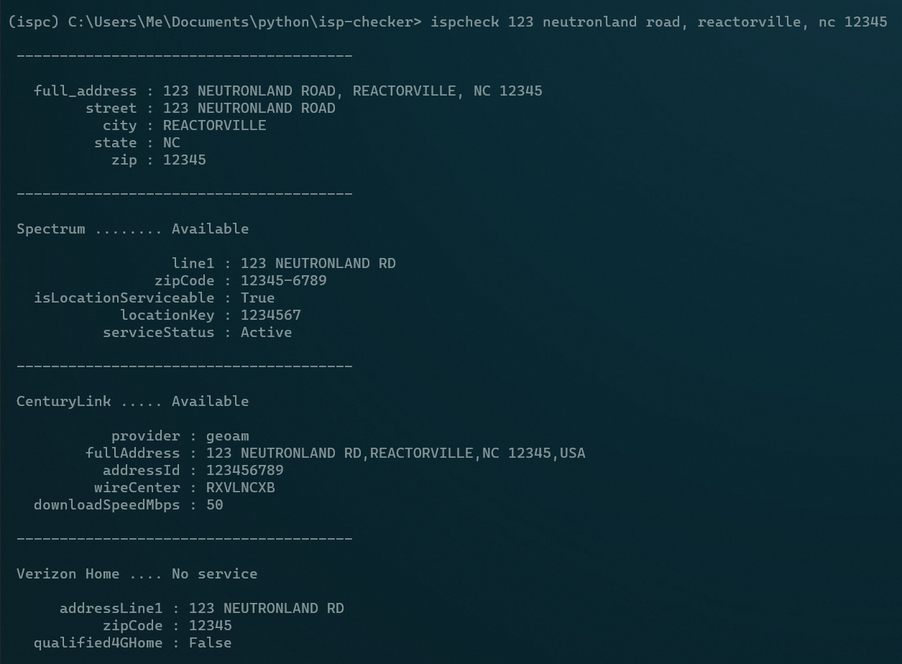

|Build Status|

isp-checker
-----------

This is a new project. Performance not guaranteed. `Documentation can be found here <https://joshuavictorchen.github.io/isp-checker/>`_.

Overview
--------

Internet Service Provider (ISP) serviceability data are not readily available for listings
on real estate websites such as Zillow and Trulia.

This means that homebuyers must manually navigate through the web interface for each potential ISP,
one at a time, in order to assess the internet connectivity options for a given listing.

The **isp-checker** program provides a framework for retrieving ISP serviceability data across providers
at any address - without having to trudge through each ISP website's clunky UI - 
by directly accessing specific API endpoints to retrieve this data.

The following ISPs and metadata are currently supported:

+---------------------------+---------------------+--------------+
| Internet Service Provider | Availability Status | Plan Details |
+===========================+=====================+==============+
| Spectrum                  | Yes                 | Coming soon  |
+---------------------------+---------------------+--------------+
| CenturyLink               | Yes                 | Yes          |
+---------------------------+---------------------+--------------+
| Verizon LTE Home Internet | Yes                 | N/A*         |
+---------------------------+---------------------+--------------+

*\*all Verizon LTE Home Internet plans have stated download speeds of 25-50 Mbps*

Installation
------------

Prerequisites:

* Python 3.8+
* Git 2.33+

Navigate into a directory of choice and grab the code from this repository::

    git clone https://github.com/joshuavictorchen/isp-checker.git isp-checker

``cd`` into ``isp-checker`` and install the application. Use of a venv is recommended::

    cd isp-checker
    pip install -U -e .

Basic Use
---------

Once installed, the ``ispcheck`` command can be executed from any working directory to check for ISP availability at a given address, or for a given Zillow or Trulia listing.

The program is in its early stages, and is not very robust. The command MUST be entered in one of the following forms, with no deviation. Two-liner addresses are not yet supported for manual address entry::

    ispcheck [street address], [city name], [state abbreviation], [5 digit zip code]
    - or -
    ispcheck [URL for Zillow listing]
    - or -
    ispcheck [URL for Trulia listing]

For example::

    ispcheck 123 neutronland road, reactorville, nc 12345

Example
-------

Refer to the `documentation <https://joshuavictorchen.github.io/isp-checker/>`_ for more details.

.. |Build Status| image:: https://github.com/joshuavictorchen/isp-checker/actions/workflows/main.yml/badge.svg?branch=master
    :target: https://github.com/joshuavictorchen/isp-checker/actions/workflows/main.yml